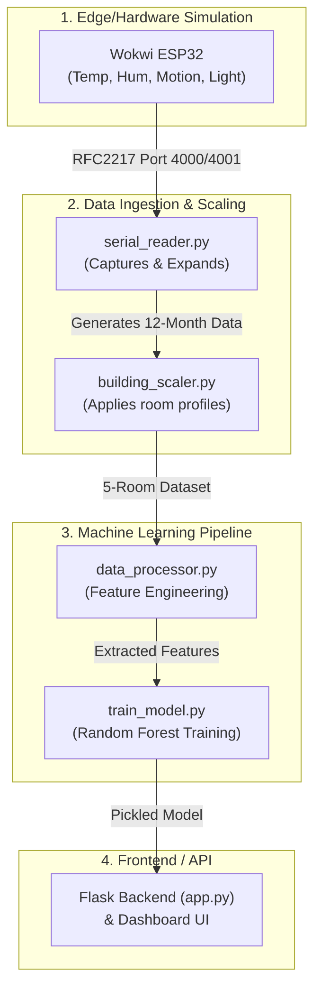

# Energy Consumption Predictor — Detailed Walkthrough

Welcome to the detailed walkthrough for the IoT-based Energy Monitoring and Prediction system. This guide explains not only *how* to run the project but *how it works* under the hood, from the simulated ESP32 hardware to the final Machine Learning dashboard.

---

## 1. Project Overview & Features

This project simulates a real-world IoT environment to monitor, scale, and predict electrical energy consumption. It integrates a **Wokwi ESP32 simulation** with a comprehensive **Python data pipeline** and a **Flask-based interactive web dashboard**. 

**Key Features:**
*   **Hardware Simulation**: Uses Wokwi to emulate an ESP32 board connected to a DHT22 (Temp/Hum), PIR (Motion), LDR (Light), and simulated relay loads.
*   **Realistic Synthetic Data**: Targets an annual consumption of **~3,000–3,600 kWh**, replicating a typical Indian household's usage patterns across 5 unique room profiles.
*   **Daily Energy Forecasting**: Uses a Random Forest Regressor (R² ~ 0.99) to predict *daily* energy consumption based on environmental factors.
*   **Financial Analytics**: Calculates cost estimates strictly using a realistic **Indian slab-based utility tariff**.
*   **Interactive Dashboard**: Real-time charts, predictive forms, and smart alerts built with HTML/CSS/JS and Chart.js.

---

## 2. System Architecture & Data Flow

The project consists of distinct stages, flowing from raw hardware data to processed analytical insights.



---

## 3. Step-by-Step Execution Guide

### Step 1: Start the Wokwi Simulation
The foundation of the data starts with the virtual ESP32. 
1. Open the `<Room_simulation>` folder (or the root project) in VS Code.
2. Ensure you have the **Wokwi for VS Code** extension installed.
3. Open the command palette (`F1` or `Ctrl+Shift+P`) and select **Wokwi: Start Simulator**.
4. The simulator will compile the `sketch.ino` file and start running. You should see the terminal printing a JSON payload every 2 seconds.

### Step 2: Capture and Expand the Data
Now we need to pull that data out of the emulator and save it. 

1. **Capture Live Data:**
   Open a terminal and run the serial reader. This script connects to the Wokwi RFC2217 port and listens to the JSON output.
   ```bash
   python simulator/serial_reader.py --mode live --readings 500
   ```
   *(Note: If Wokwi is not running, you can fallback to demo mode: `python simulator/serial_reader.py --mode demo --readings 500`)*

2. **Expand Timestamps to 12 Months:**
   A machine learning model needs a lot of data to understand seasonal and daily trends. We take the captured readings and expand them over a full year using realistic variations.
   ```bash
   python simulator/serial_reader.py --mode expand --months 12
   ```
   *This outputs `data/room_data.csv`.*

### Step 3: Scale to a Multi-Room Building
The expanded data only represents one "base" room. We scale this to a 5-room building to test the system's ability to handle diverse environments.
```bash
python simulator/building_scaler.py
```
*   **What this does:** It copies the base data and applies unique offsets. For example, the `Kitchen` profile adds temperature spikes at meal times to simulate stove usage, while the `Bedroom` profile heavily biases AC usage toward the night.
*   *This outputs `data/raw_sensor_data.csv`.*

### Step 4: Process the Data (Feature Engineering)
Before the model can learn, the raw data must be converted into meaningful features.
```bash
python data/data_processor.py
```
*   **What this does:** It calculates total energy (kWh), extracts time features (hour, day of week, weekend vs. weekday), categorizes time periods (Morning, Evening), and computes daily and monthly aggregates.

### Step 5: Train the Machine Learning Model
Train the Random Forest algorithm to predict daily energy consumption.
```bash
python ml/train_model.py
```
*   **What this does:** It loads the processed daily aggregates, splits them into training and testing sets, trains a Random Forest Regressor, and evaluates its accuracy (outputting MAE, RMSE, and an R² score). 
*   *This saves `model.pkl` and `encoders.pkl` into the `ml/` directory.*

### Step 6: Launch the Dashboard
Finally, spin up the Flask web server to view the results.
```bash
python backend/app.py
```
*   Open your browser and navigate to **[http://127.0.0.1:5000](http://127.0.0.1:5000)**.

---

## 4. Deep Dive into Key Components

### A. Realistic Room Profiling
To make the dataset challenging and realistic, `building_scaler.py` injects strict logic:
*   **Living Room:** The baseline profile. Standard TV/Fan usage during waking hours.
*   **Bedroom:** Cooler baseline temperatures; AC runs predominantly from 10 PM to 6 AM.
*   **Kitchen:** Warmer baseline; features a "Heater" appliance that acts as a proxy for stoves/ovens, triggering heavily around 8 AM, 1 PM, and 7 PM.
*   **Office:** Standardized AC and heavy lighting usage strictly between 9 AM and 6 PM.
*   **Bathroom:** Short, sparse, intense bursts of heater usage (geysers) in the morning and evening.

### B. Machine Learning (Daily Forecasting)
Instead of predicting how many watts a device draws in the next 15 minutes, the pipeline answers a more practical question: *"Given it is a Tuesday in July, and the average temperature is 32°C, how much energy will the Bedroom AC consume today?"*
The model achieves an R² score of ~0.99 by heavily weighting the `Device Type` and `Ambient Temperature` features.

### C. Slab-Based Utility Pricing
The dashboard doesn't just multiply energy by a flat rate. It uses an algorithmic representation of an **Indian Electricity Tariff Slab**:
*   0-200 kWh: Base low rate (e.g., ₹4.0 / kWh)
*   201-400 kWh: Medium rate (e.g., ₹6.0 / kWh)
*   401+ kWh: High rate (e.g., ₹8.0 / kWh)
This means saving 10 kWh when you are in the highest slab saves exponentially more money than saving it in the lowest slab.

---

## 5. Dashboard Tour

The frontend is a dark-themed, glassmorphism UI utilizing `Chart.js`.

1. **Summary Cards:** Top-level metrics showing Total Energy, Total Cost (INR), Peak Power, and total readings analyzed.
2. **Predictive Form:** Select a Room, Device, Month, Temperature, and Humidity to instantly get a daily consumption and cost forecast based on the trained Random Forest model.
3. **Daily Trend & Monthly Trend:** Visualizations tracking historical power usage over time.
4. **Feature Importances Chart:** Shows exactly what variables the Machine Learning model relies on most (usually Device Type, then Temperature).
5. **Alerts & Tips Module:** An autonomous routine that scans real-time data and flags anomalies (e.g., "⚡ Critical: High average power in Kitchen").

````carousel

<!-- slide -->

<!-- slide -->

````
