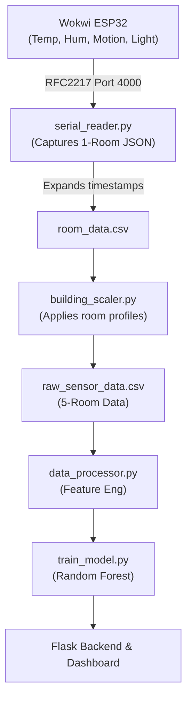

# Energy Consumption Predictor — Walkthrough

## Project Summary

Built a complete IoT-based energy monitoring and prediction system integrated with **Wokwi VS Code extension**. The project takes real simulated data from an ESP32 room simulation and scales it up to train a predictive ML model for a 5-room building.

### Architecture Data Flow


## Setup & Run Instructions

**1. Generate IoT Data (Wokwi + Python Pipeline)**
*   Open your `<Room_simulation>` folder in VS Code and hit `F1` → **Wokwi: Start Simulator**. Note: It outputs JSON every 2 seconds.
*   Once running, capture the data via RFC2217:
    ```bash
    python simulator/serial_reader.py --mode live --readings 500
    ```
    *(Fallback: `python simulator/serial_reader.py --mode demo --readings 500` if Wokwi isn't active).*
*   Expand timestamps to 6 months:
    ```bash
    python simulator/serial_reader.py --mode expand --months 6
    ```
*   Scale the single room to the 5-room building:
    ```bash
    python simulator/building_scaler.py
    ```

**2. Process Data & Train ML Model**
```bash
python data/data_processor.py
python ml/train_model.py
```

**3. Run the Dashboard**
```bash
python backend/app.py
```
Open **[http://127.0.0.1:5000](http://127.0.0.1:5000)** in your browser.

---

## Technical Highlights

### 1. Wokwi Integration
- **`wokwi.toml`** configured with `rfc2217ServerPort = 4000` to stream serial data out of the emulator.
- **`sketch.ino`** updated to output a clean JSON payload mapping temperature, humidity (`DHT22`), motion (`PIR`), light (`LDR`), and relay states.

### 2. Building Scaler (`building_scaler.py`)
Replicates the 1-room data into 5 unique profiles with realistic variance:
- **Living Room:** Base data
- **Bedroom:** AC biased heavily towards night-time hours
- **Kitchen:** Heater (simulating stove/cooking) spikes at 7-9am, 12-2pm, and 6-9pm.
- **Office:** High daytime usage, minimal night usage.
- **Bathroom:** Short, sparse bursts of heater usage.

### 3. ML Model Performance
- **Model Used:** Random Forest Regressor
- **R² Score:** **0.9912**
- Top driving features are Device Type, Device Status, and specific environmental states (Temp/Hum).

### 4. Dashboard
Fully responsive HTML/JS/CSS using Chart.js, featuring dark-mode glassmorphism. It includes actual predictive APIs, displaying cost estimates, system alerts (based on real thresholds), and optimization tips!

````carousel

<!-- slide -->

<!-- slide -->

````
